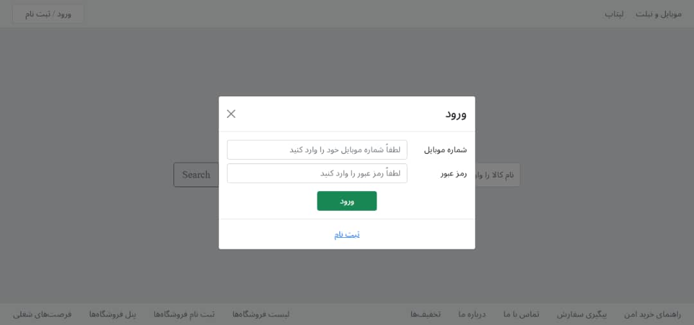
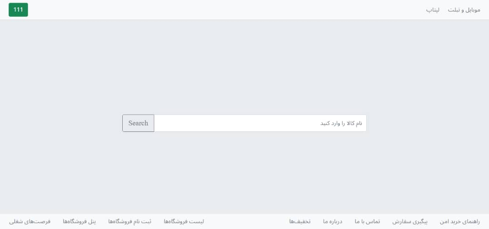
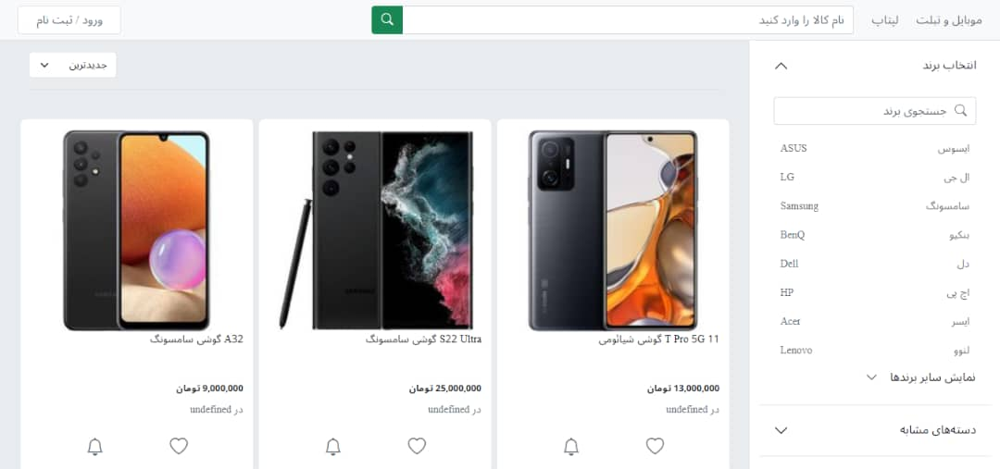
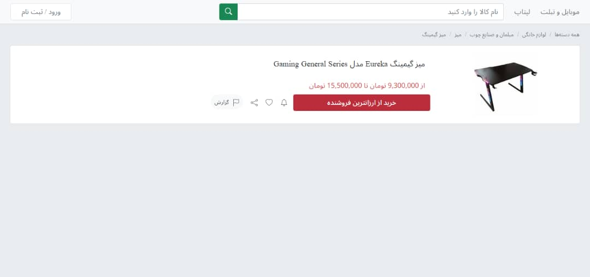
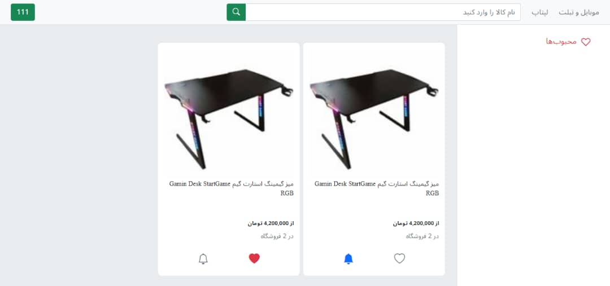

# TorobClone
# Why?

    <b>Internet Engineering Course Final Project(Spring 2022)

# Use : 
- HTML 
- CSS
- Bootstrap
- ReactJS
- NodeJS
- MongoDB

# Data :

[Torob Website](https://www.Torob.com) 

# Routes :

[Back-End Routes  Postman Collection](https://www.getpostman.com/collections/8ae046603102fb324112) 

# How To Install?
- `npm install`

# How To Run?
- `npm start`

# Final Result 
# SignUp & Login

# HomePage

# SearchPage

# ProductPage

# ProfilePage

